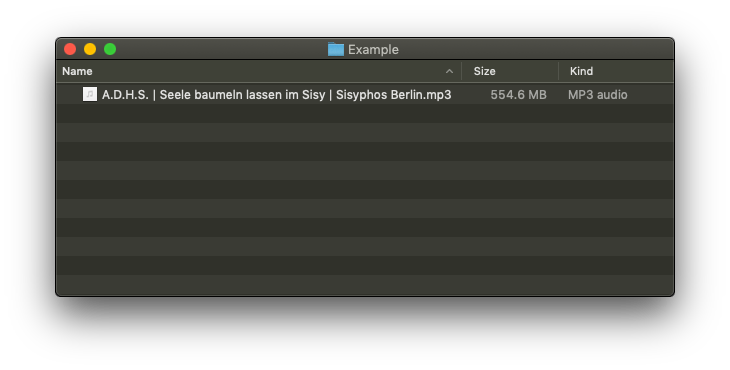
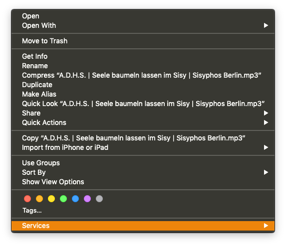
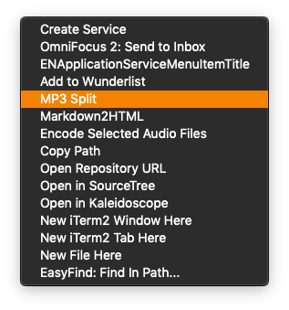
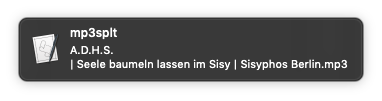
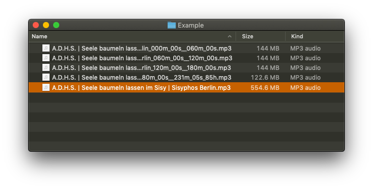

# MP3 Split Workflow

Split your MP3s into 1hour chunks with a single mouse-click and without quality loss directly within your macOS Finder.


## Motivation

This Automator workflow was created for allowing large MP3s to be uploaded into iTunes match. I love DJ sets and those often are too large to get uploaded due to Apple's limits on iTunes match (max 200mb | 2hours per file).


## Dependencies

[mp3splt](http://mp3splt.sourceforge.net/mp3splt_page/home.php) - Commandline utility to split MP3, OGG Vorbis and native FLAC files without decoding.


## Installing

First, make sure mp3splt is installed. I would recommend using homebrew for that;

```bash
brew install mp3splt
```

Next, simply click on this workflow within your Finder to get it installed.


## Usage

Navigate your Finder towards the MP3 you want to split.



Control click / Right click on the MP3 to get to the **Services** menu.



Chose the **MP3 Split** item.



Let it do its thing and get notified about progress. This should be fast - takes like 5 seconds for a 500mb MP3 on my machine. Once the notification disappears, you are all set.



The results will be a bunch of MP3s where the original name is extended by start and end time of the specific interval. Additionally, the MP3s will have a track-number within the ID3 information so you do not have to do that manually.




## Credits

Clobbed together with love for music and passion for tinkering by [Till Toenshoff](https://twitter.com/ttoenshoff).
Shout out to Matteo Trotta and [Alexandru Munteanu](m@ioalex.net) for releasing and maintaining the mp3splt commandline utility.
